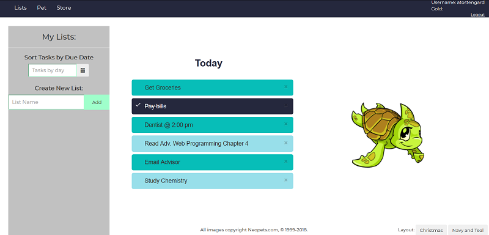

# web-programming-classwork
A semester-long, two-person project built using HTML/CSS/JS/PHP.

The project is a gamified productivity web application in which users can both create task lists and own pets; when users complete tasks, their pets grow happier, but if users do not complete tasks by their deadlines (or a certain number of tasks a day), the pets grow sad. We didn't end up having time to implement task timers so that pets would react to them, but most major functionality was implemented. Users can create an account, create task lists, complete tasks to receive in-game currency (gold), and buy items for pet in the in-game store.  
Task List Page: 

The original git was not on this account.
